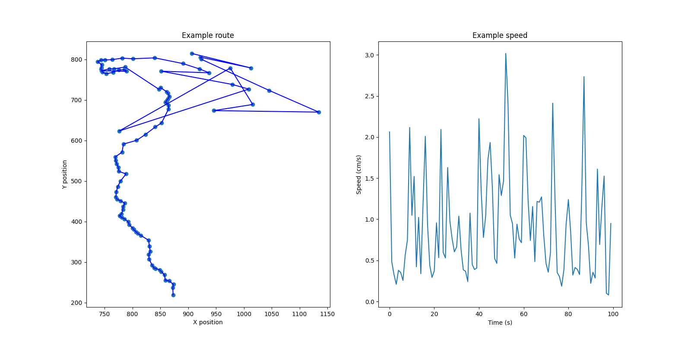
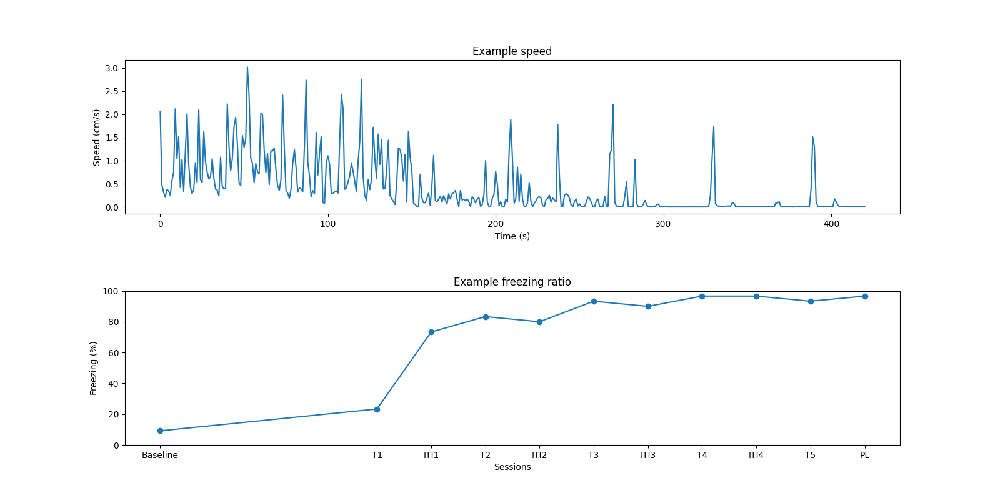

# freezy

- Calculate mouse speed using DLC coordinates.
- Automatic trace smoothing through '[savitzky golay](https://en.wikipedia.org/wiki/Savitzky%E2%80%93Golay_filter)'
  filter.
- Detect freezing using speed.

# How to use

### For python script users: 
1. Install freezy package
```
pip install freezy
```
2. Refer example codes in ./examples.

### For GUI users:
1. Install freezy package.
```
pip install freezy
```
2. Install other dependencies.
```
pip install numpy
pip install pandas
pip install pyqt6
pip install pyqt6-webengine
pip install plotly
pip install openpyxl
```
3. Install deeplabcut dependencies (https://deeplabcut.github.io/DeepLabCut/docs/installation.html).
```
// Deeplabcut installation instructions at 2026.04.10

// Install pytorch
pip3 install torch torchvision --index-url https://download.pytorch.org/whl/cu128

// Install deeplabcut
pip install --pre deeplabcut[gui]

// Check installation; If you can see 'True' and 'your GPU name', the installation was succeed.
python -c "import torch; print(torch.cuda.is_available()); print(torch.cuda.get_device_name(0))"
```
4. Run ```ui_main.py``` in ./GUI (**Freezy application will be deployed ASAP!**).

# Speed formula

$$ v = {{\Sigma d_n}\over{p}} $$

- $v$: Speed [cm/s]
- ${\Sigma d_n}$: Sum of distance during 1 second.
- $p$: Pixels for 1 cm.

# Examples

- Refer 'examples' directory.



